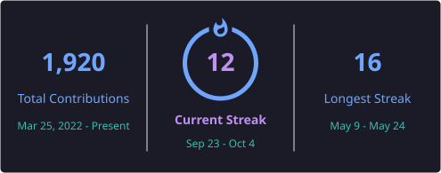

<h1 align="center">YooBi Lee</h1>

<strong>QA Engineer &amp; Builder</strong>

  동작은 근거로 확인하고, 반복되는 불편은 도구로 줄입니다. 
  테스트를 설계하고 검증하며, 직접 만든 도구를 사용하고 개선합니다.

  <a href="https://github.com/yoobilee/noai-music">NoAI</a> &nbsp; / &nbsp;
  <a href="https://worky-ai.vercel.app">Worky</a> &nbsp; / &nbsp;
  <a href="https://github.com/yoobilee/looma">Looma</a>

---

## Now

- **Software QA** — 모바일과 웹 서비스의 테스트 설계, 회귀 테스트, 성능 검증을 중심으로 일합니다.
- **Looma 개발 중** — 업무 기록과 QA 작업을 돕는 개인 도구를 만들고 있습니다. [Repository](https://github.com/yoobilee/looma)

## Selected Projects

<table>
  <tr>
    <td width="50%" valign="top">
      <h3>🎧 NoAI</h3>
      
<strong>공식 AI 표시를 확인하는 브라우저 확장</strong>

      
YouTube 콘텐츠를 숨기거나 흐리게 처리하고, 표시만 남길 수도 있습니다. YouTube Music에서는 자동 건너뛰기를 지원합니다.

      
<a href="https://github.com/yoobilee/noai-music">Repository</a> / <a href="https://chromewebstore.google.com/detail/noai/eiddibmnpcdbgdmeoipniomddiboikkf">Chrome Web Store</a>

    </td>
    <td width="50%" valign="top">
      <h3>🛠️ Worky</h3>
      
<strong>흩어진 업무를 한곳에서 다루는 AI 웹앱</strong>

      
문서 작성, 일정, 거래처, 업무 Q&amp;A와 이슈 정리를 지원합니다. 직접 사용하며 실제 업무에서 생긴 불편을 개선합니다.

      
<a href="https://github.com/yoobilee/worky">Repository</a> / <a href="https://worky-ai.vercel.app">Live</a>

    </td>
  </tr>
  <tr>
    <td width="50%" valign="top">
      <h3>💳 Smart Wallet</h3>
      
<strong>거래 내역과 자산을 정리하는 대시보드</strong>

      
은행과 카드 거래를 모아 월별 수입과 지출, 자산 현황을 확인합니다. 취소, 할부, 이체 등 거래 유형을 구분해 정리합니다.

      
<a href="https://github.com/yoobilee/smart-wallet-dashboard">Repository</a>

    </td>
    <td width="50%" valign="top">
      <h3>🎨 SHIFT</h3>
      
<strong>세 업종의 화면과 흐름을 비교하는 쇼케이스</strong>

      
산업기술, 인테리어, F&amp;B 콘셉트를 전환하며 살펴봅니다. 반응형 화면, 밝은 테마와 어두운 테마, 키보드 탐색을 구현했습니다.

      
<a href="https://github.com/yoobilee/shift-ai-website-showcase">Repository</a> / <a href="https://shift-ai-website-showcase.vercel.app">Live</a>

    </td>
  </tr>
</table>

## Skills & Tools

**QA & Testing**

**Web & Data**

**Workflow**

## Approach

사양과 실제 동작이 다르면 재현 조건, 데이터, 로그를 함께 확인합니다. 정상 흐름뿐 아니라 경계값과 지연, 반복 입력 같은 예외 조건도 나누어 살핍니다. AI와 협업해 만든 결과는 테스트와 리뷰로 검증합니다.

<strong>More projects</strong>

| Project | Description |
| --- | --- |
| [Worky Desktop](https://github.com/yoobilee/worky-desktop) | 거래처별 카카오톡 채팅방 연결과 보고 메시지 작성을 돕는 Windows 앱 |
| [Personal Dashboard](https://github.com/yoobilee/personal-dashboard-ui) | 포트폴리오 겸 실사용 대시보드 SPA |
| [GNU Portfolio](https://github.com/yoobilee/gnu-portfolio) | 그누보드5 테마와 게시판 스킨을 반응형으로 구성한 포트폴리오 |
| [Inflave](https://github.com/K-Software-BootCamp/2023KEB_Marketer_pro) | K-Software 부트캠프의 마케터 지원 서비스 프로젝트 |
| [DjangoServer](https://github.com/yoobilee/DjangoServer) | Django 기반 백엔드 서버 프로젝트 |
| [Campus Guide](https://github.com/yoobilee/kgu-campus-guide) | 경기대학교 캠퍼스 통합 정보 포털 |
| [Arduino Nano 33 IoT](https://github.com/yoobilee/Arduino-Nano-33-iot) | 기초 캡스톤 디자인 프로젝트 |

<strong>Awards</strong>

| 수상 | 주관 | 날짜 |
| --- | --- | --- |
| K-Software Empowerment Bootcamp 우수상 | 과학기술정보통신부 / 성균관대, 신세계I&C | 2023.08 |
| 우수논문상 (동상) | 한국정보기술학회 | 2023.06 |
| 심화 캡스톤 디자인 동상 | 경기대학교 | 2023.06 |
| 기초 캡스톤 디자인 금상 | 경기대학교 | 2022.06 |

## GitHub Activity

  

  

---

확인하고, 만들고, 계속 개선합니다.

